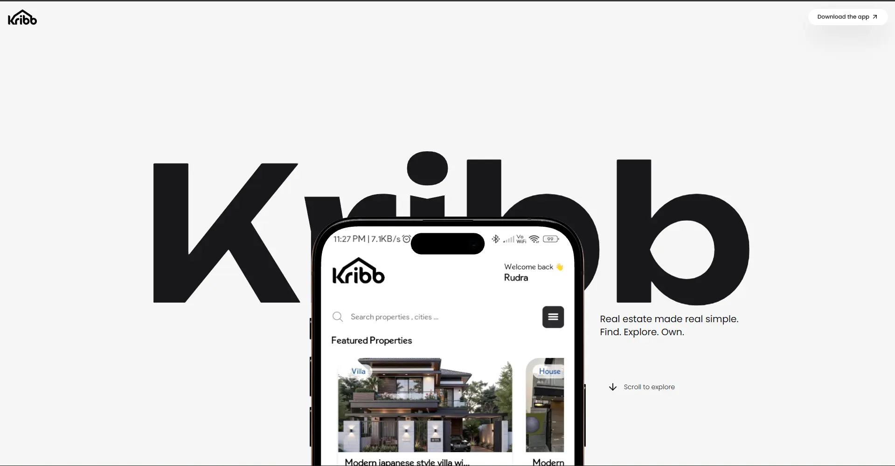

# Kribb Web



<p align="center">
  <strong>The official landing page for Kribb.</strong>
</p>

<p align="center">
  Discover properties, explore the app, and download Kribb for Android.
</p>

<p align="center">
  <a href="https://kribb.vercel.app">🌐 Live Website</a>
</p>

---

## 🏠 What is Kribb?

Kribb is a modern real estate platform designed to make property discovery simple and intuitive.

Browse properties, save favorites, explore locations, and connect with agents through a clean and user-friendly mobile experience.

This repository contains the official landing page built to showcase the Kribb mobile app and provide Android downloads.

---

## 🚀 Live Website

**Website:** https://kribb.vercel.app

---

## 📱 Android Download

Download the latest Android version directly from the website.

> Currently available for Android only.

---

## ✨ Features

* Interactive 3D Experience
* Smooth Scroll Animations
* Modern Landing Page Design
* Mobile App Showcase
* Responsive Layout
* Fast & Lightweight
* Android Download Access

---

## 🛠 Tech Stack

* React
* Vite
* Java Script
* Tailwind CSS
* React Three Fiber
* Drei
* Framer Motion
* Lenis
* Lucide React

---

## 💻 Run Locally

```bash
git clone https://github.com/WebNerd69/kribb-web

cd kribb-web

npm install

npm run dev
```

---

## 👨‍💻 Developer

### Rudra Roy

* LinkedIn: https://www.linkedin.com/in/rudra-pratap-roy-718393248/
* Email: [rudra.webnerd69@gmail.com](mailto:rudra.webnerd69@gmail.com)

---

## ⭐ Support

If you enjoyed this project, consider giving it a ⭐ on GitHub.

Your support helps the project grow and motivates future updates.

---

<p align="center">
  Made with ❤️ by Rudra Pratap Roy
</p>

<p align="center">
  <strong>Find your next home with Kribb.</strong>
</p>
